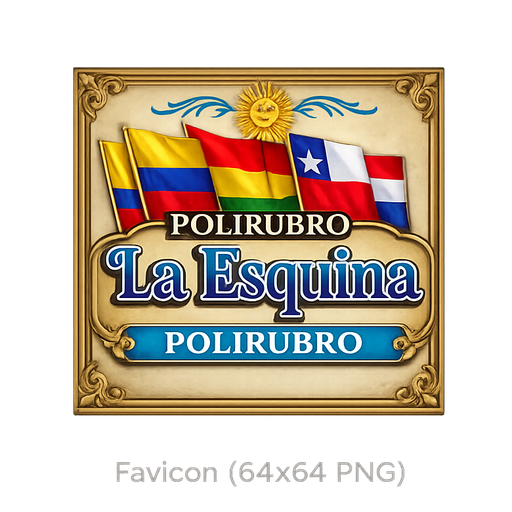

<p align="center">
  
</p>

<p align="center">
  
  &nbsp;&nbsp;
  
</p>

<p align="center">
  <strong>La Esquina - Polirubro</strong><br>
  Almacén, granja y kiosco · Sistema de stock, ventas y gastos
</p>

<p align="center">
  Electron + Angular · SQLite local · Funciona sin internet
</p>

---

## Qué hace

Aplicación de escritorio para llevar el negocio desde la caja: productos, ventas con escáner, stock, gastos, estadísticas e impresión de tickets térmicos.

| Módulo | Descripción |
|--------|-------------|
| **Dashboard** | Resumen del día: ventas, gastos y accesos rápidos |
| **Ventas** | Carrito, pagos, descuentos, escáner USB y ticket ESC/POS |
| **Stock** | Catálogo, categorías, importación Excel, alertas de stock bajo |
| **Gastos** | Registro por categoría con navegación por mes/año |
| **Estadísticas** | Ingresos, top productos, métodos de pago y valor de inventario |

<p align="center">
  
  &nbsp;
  
  &nbsp;
  
</p>

---

## Instalación

### Prerrequisitos

- Node.js 18+
- npm

### Clonar e instalar

```bash
git clone https://github.com/MatyBartel/LaEsquina.git
cd LaEsquina
npm install
npm run postinstall
```

### Base de datos

La app usa una **base propia e independiente**:

```
Documentos/Polirubro La Esquina/datos/polirubro.db
```

No lee ni modifica otras bases. Al abrir por primera vez arranca vacía.

Desde el **dashboard** podés abrir esa carpeta con el botón de la esquina inferior derecha.

---

## Cómo levantar el proyecto

### Desarrollo (recomendado mientras programás)

```bash
npm run electron:dev
```

Levanta Angular en `localhost:4200` y abre Electron encima.

### Producción local (probar el build sin instalador)

```bash
npm run build:clean
npm run electron
```

> Si ves pantalla en blanco o *"No se encontró la aplicación"*, volvé a correr `npm run build:clean`.

### Instalador Windows (notebook del negocio)

```bash
npm run electron:build
```

El `.exe` queda en `dist-electron/`. Ahí también se ve bien el **icono en la barra de tareas**.

### Solo web (sin Electron)

```bash
npm run start
```

→ http://localhost:4200

---

## Build confiable

Si algo falla o queda desactualizado, en PowerShell o CMD:

```bash
npm run clean
npm install
npm run rebuild:native
npm run build:clean
npm run electron
```

Instalador:

```bash
npm run electron:build
```

### Errores frecuentes

| Problema | Solución |
|----------|----------|
| Pantalla blanca al abrir Electron | `npm run build:clean` y después `npm run electron` |
| Cambios de Angular no se ven | No uses solo `electron`; hace falta `build` antes |
| Error con `better-sqlite3` | `npm run rebuild:native` |
| Build raro / archivos viejos | `npm run clean` y volver a buildear |
| Icono genérico en la barra | Usá el `.exe` de `electron:build`, no `electron:dev` |

**Importante:** `electron:dev` usa el servidor en vivo. `npm run electron` usa los archivos compilados en `dist/la-esquina/browser/`. Son dos modos distintos.

---

## Scripts

| Comando | Qué hace |
|---------|----------|
| `npm run electron:dev` | Desarrollo con recarga |
| `npm run build:clean` | Limpia y compila Angular (producción) |
| `npm run electron` | Abre la app con el build compilado |
| `npm run electron:build` | Build + instalador Windows |
| `npm run electron:pack` | Build sin instalador (carpeta descomprimida) |
| `npm run clean` | Borra `dist`, `dist-electron` y caché |
| `npm run rebuild:native` | Recompila SQLite/USB para Electron |

---

## Estructura

```
LaEsquina/
├── src/app/              # Angular (componentes, servicios)
├── electron/             # Proceso principal Electron + impresión
├── public/logos/         # Marca, íconos de módulos, escáner
└── assets/               # icon.ico para Windows
```

---

<p align="center">
  
</p>

<p align="center"><sub>MIT · La Esquina - Polirubro</sub></p>
