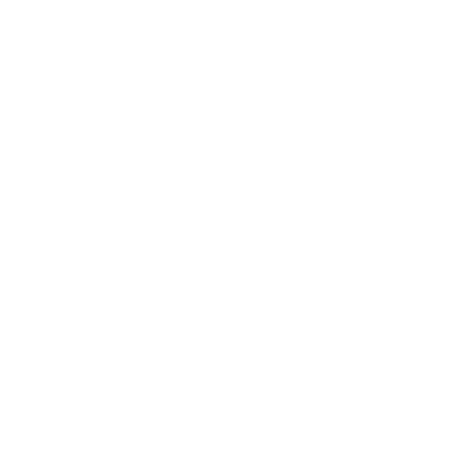

<p align="center">
  
</p>

<p align="center">
  
</p>

<h1 align="center">La Esquina - Polirubro</h1>

<p align="center">
  Sistema de escritorio para gestión integral de un polirubro — almacén, granja y kiosco. Stock, ventas, gastos, estadísticas e impresión de tickets.
</p>

<p align="center">
  
  
  
  
  
</p>

---

## Descripción

**La Esquina - Polirubro** es una aplicación de escritorio desarrollada con **Electron** y **Angular** para administrar el negocio desde la caja. Incluye escáner de código de barras, ticket térmico ESC/POS y base de datos local — no necesita internet.

## Capturas y módulos

<table>
  <tr>
    <td align="center" width="20%">
      <br/>
      <strong>Dashboard</strong><br/>
      <sub>Resumen del día, ventas, gastos y stock bajo</sub>
    </td>
    <td align="center" width="20%">
      <br/>
      <strong>Ventas</strong><br/>
      <sub>Carrito, escáner USB, pagos, descuentos y ticket</sub>
    </td>
    <td align="center" width="20%">
      <br/>
      <strong>Stock</strong><br/>
      <sub>Productos, categorías, Excel, códigos de barras</sub>
    </td>
    <td align="center" width="20%">
      <br/>
      <strong>Estadísticas</strong><br/>
      <sub>Ingresos, top productos, pagos e inventario</sub>
    </td>
    <td align="center" width="20%">
      <br/>
      <strong>Gastos</strong><br/>
      <sub>Registro por categoría con filtro por día/mes/año</sub>
    </td>
  </tr>
</table>

## Características

- **Dashboard** — Vista general de productos, ventas del día, gastos y stock bajo
- **Gestión de productos** — Alta con categoría, código de barras, costo, margen y tipo de venta (unidad / kilo / litro)
- **Sistema de ventas** — Escáner global, múltiples productos, medios de pago, descuentos y ticket térmico
- **Control de stock** — Alertas automáticas de stock mínimo e importación Excel
- **Gastos** — Registro por categoría con navegación por fecha
- **Estadísticas** — Ingresos por día, métodos de pago, valor de stock total y más
- **Base de datos local** — SQLite persistente en `Documentos/Polirubro La Esquina/`
- **Sin internet** — Funciona 100% offline en tu computadora

## Instalación

### Prerrequisitos

- [Node.js](https://nodejs.org/) 18+
- npm

### Pasos

```bash
git clone https://github.com/MatyBartel/LaEsquina.git
cd LaEsquina
npm install
npm run postinstall
```

### Base de datos

La app usa una **base de datos propia e independiente**:

```
Documentos/Polirubro La Esquina/datos/polirubro.db
```

No comparte datos con otras instalaciones. Al abrir por primera vez, la base arranca vacía.

> Desde el dashboard podés abrir esa carpeta con el botón de guardar (esquina inferior derecha).

## Ejecutar

### Desarrollo (recomendado para modificar)

```bash
npm run electron:dev
```

### Producción local (probar el build sin instalador)

```bash
npm run build:clean
npm run electron
```

Si ves pantalla en blanca, volvé a correr `npm run build:clean`.

### Instalador Windows

```bash
npm run electron:build
```

El instalador `.exe` queda en `dist-electron/`.

## Build confiable

Si algo falla o queda desactualizado, corré en orden:

```bash
npm run clean
npm install
npm run rebuild:native
npm run build:clean
npm run electron
```

Para el instalador:

```bash
npm run electron:build
```

### Errores frecuentes

| Problema | Solución |
|----------|----------|
| Pantalla blanca al abrir Electron | `npm run build:clean` y después `npm run electron` |
| Cambios de Angular no se ven | No uses solo `electron`; hace falta `build` antes |
| Error con `better-sqlite3` | `npm run rebuild:native` |
| Build raro / archivos viejos | `npm run clean` y volver a buildear |
| Icono genérico en la barra de tareas | Usá el `.exe` de `electron:build`, no `electron:dev` |
| Solo querés probar en el navegador | `npm run start` → http://localhost:4200 |

> **Nota:** `electron:dev` usa el servidor en vivo (`localhost:4200`). `npm run electron` usa los archivos compilados en `dist/la-esquina/browser/`.

## Scripts

| Comando | Descripción |
|---------|-------------|
| `npm run electron:dev` | Desarrollo con recarga en vivo |
| `npm run build:clean` | Limpia y compila Angular (producción) |
| `npm run electron` | Abre la app con el build compilado |
| `npm run electron:build` | Compila y genera instalador Windows |
| `npm run electron:pack` | Build sin instalador (carpeta descomprimida) |
| `npm run clean` | Borra `dist`, `dist-electron` y caché de Angular |
| `npm run rebuild:native` | Recompila módulos nativos (SQLite/USB) para Electron |

## Estructura del proyecto

```
LaEsquina/
├── src/app/              # Angular — componentes, servicios y rutas
├── src/app/config/       # brand.config.ts (nombre y subtítulo)
├── electron/             # Proceso principal de Electron + ticket ESC/POS
├── public/logos/         # Banner, iconos de marca y módulos
└── assets/               # icon.ico para ventana e instalador Windows
```

## Identidad visual

<p align="center">
  
  &nbsp;&nbsp;
  
</p>

| Elemento | Valor |
|----------|-------|
| Nombre | La Esquina - Polirubro |
| Subtítulo | Almacén, granja y kiosco |
| Color principal | `#6BBDD0` |
| Color oscuro | `#3D8FA3` |
| Fondo | `#4A8798` |
| Acento | `#D4B06A` |

## Licencia

MIT
